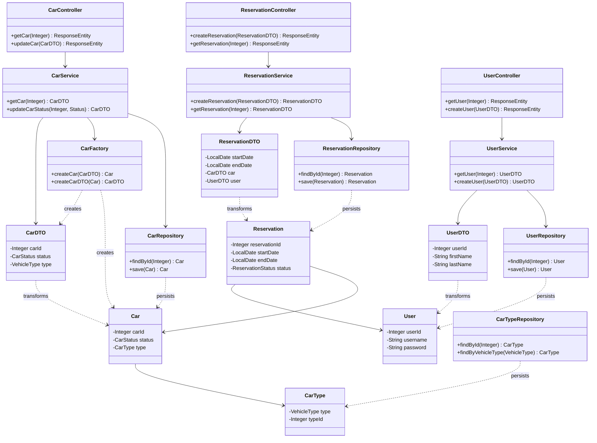

# Car Rental Project

A robust car rental system built with Spring Boot implementing MVC architecture and factory patterns for vehicle management.

## Architecture Overview

The Car Rental Project demonstrates robust SOLID principles through clear separation of concerns and single responsibility
in each component, while the MVC architecture ensures clean data flow from the UI through controllers and services
down to the H2 database. The implementation of factory patterns and DTOs further strengthens the design by providing
flexible object creation and secure data transfer between layers.

### MVC Pattern

- **Model**: Entity classes (Car, CarType, User, Reservation)
- **Service**: Services for business logic (CarService, ReservationService, UserService)
- **Controller**: REST endpoints handling business logic routing
- **View**: UI components for web interface

### Design Patterns

- **Factory Pattern**: Vehicle creation and type management, extensible for future vehicle types
- **Repository Pattern**: Data access abstraction
- **DTO Pattern**: Clean data transfer between layers
- **Service Layer Pattern**: Business logic encapsulation

## Project Structure

### Core Components

#### Entities

Entities are the core domain objects that map directly to database tables and represent
the fundamental data structures of the car rental system.

- `Car`: Vehicle representation: Active, Reserved, Maintenance
- `CarType`: Vehicle category definition: Sedan, SUV, Van
- `User`: User account details
- `Reservation`: Reservation records: Active, Cancelled, Completed

#### Repositories

Repositories provide a clean abstraction layer for database operations, handling
all CRUD (Create, Read, Update, Delete) operations for their respective entities.

- `CarRepository`: Vehicle data access
- `ReservationRepository`: Booking records management
- `UserRepository`: User data persistence
- `CarTypeRepository`: Vehicle categories management

#### DTOs

DTOs serve as lightweight data carriers that safely transfer information between the application
layers while hiding internal entity complexity.

- `CarDTO`: Vehicle data transfer
- `ReservationDTO`: Booking information transfer
- `UserDTO`: User data transfer

#### Services

Services encapsulate the core business logic and rules, acting as the intermediary
between controllers and repositories while enforcing domain-specific operations and validations.

- `CarService`: Vehicle inventory and availability logic
- `ReservationService`: Booking management and validation
- `UserService`: User authentication and profile management

#### Controllers

The Controllers in this Car Rental system handle HTTP requests and orchestrate the flow
between the frontend UI and backend services.

- `CarController`: Handles vehicle operations
- `ReservationController`: Manages booking flows
- `UserController`: User management endpoints

### Testing

Comprehensive integration tests covering:

- Multiple reservation scenarios
- Overlapping booking prevention
- Multi-car type availability
- Edge case handling

## Class Architecture

### Layred Architecture Diagram

Outlines the separation of concerns and the flow of data between different layers of the application.

```mermaid
graph TB
    subgraph UI_Layer[Presentation Layer]
        UI[UI Components]
    end

    subgraph Controller_Layer[Controller Layer]
        CTRL[REST Controllers]
    end

    subgraph Service_Layer[Service Layer]
        SVC[Business Services]
        DTO[DTOs]
        FAC[Factories]
    end

    subgraph Repository_Layer[Repository Layer]
        REPO[JPA Repositories]
        ENT[Entities]
    end

    subgraph Database_Layer[Database Layer]
        H2[H2 In-Memory Database]
    end

    UI --> CTRL
    CTRL --> SVC
    SVC --> REPO
    REPO --> H2

    style UI_Layer fill:#2B5B84
    style Controller_Layer fill:#1E4620
    style Service_Layer fill:#8B4513
    style Repository_Layer fill:#8B7355
    style Database_Layer fill:#2F4F4F

```



### Class Diagram



## Dependencies

```

<dependencies>
    <dependency>
        <groupId>org.springframework.boot</groupId>
        <artifactId>spring-boot-starter-web</artifactId>
    </dependency>
    <dependency>
        <groupId>org.springframework.boot</groupId>
        <artifactId>spring-boot-starter-data-jpa</artifactId>
    </dependency>
    <dependency>
        <groupId>com.vaadin</groupId>
        <artifactId>vaadin-spring-boot-starter</artifactId>
    </dependency>
    <dependency>
        <groupId>com.h2database</groupId>
        <artifactId>h2</artifactId>
        <scope>runtime</scope>
    </dependency>
    <dependency>
        <groupId>org.springframework.boot</groupId>
        <artifactId>spring-boot-starter-test</artifactId>
        <scope>test</scope>
    </dependency>
</dependencies>
```

## Features

- Car reservation system
- Multiple vehicle type support
- User management
- Booking validation
- Real-time availability tracking
- H2 in-memory database
- Vaadin-based UI

## Getting Started

- Clone the repository
- Run `mvn clean install`
- Start the application with `mvn spring-boot:run`
- Access the H2 console at `/h2-console`
- Access the application at `localhost:8080`
